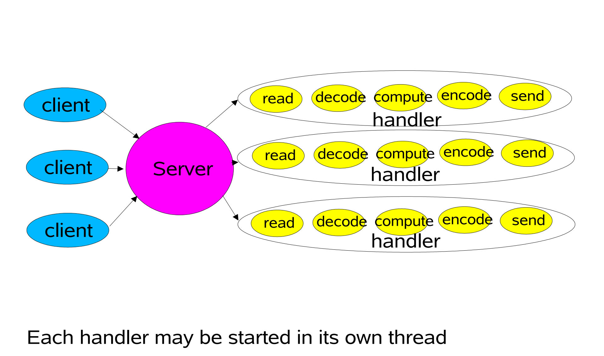
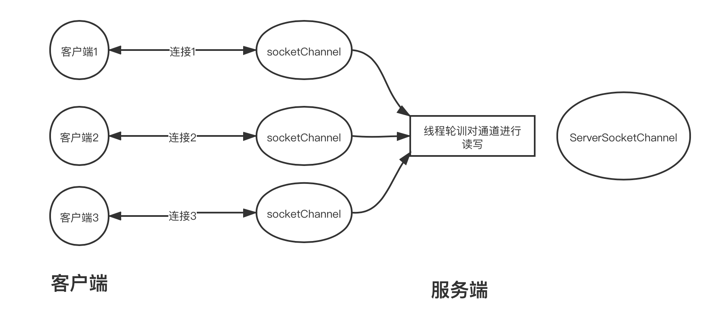
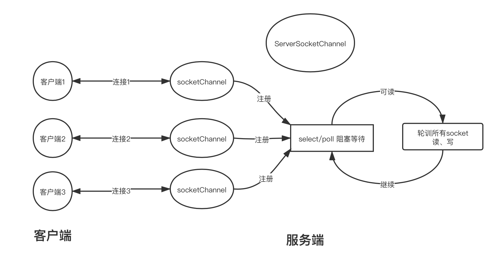

# I/O模型

## 阻塞式I/O

执行`recvfrom`系统调用时, 进程由用户态切换为内核态, 并等待数据(等待过程, 不会参与CPU调度). 直到磁盘/网卡数据准备完毕, 触发中断,  内核进程唤醒, 将数据读取至内核,并在切换为用户态前, 将数据从内核拷贝至用户空间

(图片摘自《UNIX网络编程》)


站在Java角度, 使用socket编程时, 如果采用的是阻塞式I/O, 那么socket进行`read()`时, 会阻塞当前线程; 为了不对其它socket(1个连接对应1对socket)产生影响, 会采用一线程一socket的方式; 这种方式, 在有大量连接时, 会创建大量的线程, 对服务端会造成很高的负载.


和Doug Lea大神画的图类似


## 非阻塞I/O

同样还是执行`recvfrom`系统调用 (socket被标记为非阻塞), 数据未准备好时, 会立即返回`EWOULDBLOCK`错误. 需要对`recvfrom`进行多次调用, 不断的对内核进行轮训, 直到返回成功.


不过, 这种方式打破了阻塞式I/O 1个socket1个线程的局限性, 可以采用单个线程对多个socket进行轮训, 节约资源

Java NIO中, 可通过`configureBlocking(boolean)`方法给`SocketChannel`和`ServerSocketChannel`配置非阻塞模式
```java
// Java NIO, 配置非阻塞
public abstract class AbstractSelectableChannel
    extends SelectableChannel
{
    public final SelectableChannel configureBlocking(boolean block) {
        // ...
    }
}
```



可以对socketChannel中数据的读、解码、处理、编码、写放在异步的线程池中进行处理, 避免一个socketChannel长时间的处理对其它通道的影响; 

该方式方式有一个明显的瓶颈, 就是随着连接数的增加, 轮训的效率会不断的降低, 如果有上万的连接, 那么每次则需要轮训1万次; 并且即时当前所有的通道都没有可读的数据, 也要进行轮训, 比较盲目, 白白的浪费CPU资源;

## 多路复用I/O

`select`, `poll`和`epoll`系统调用, 提供了多路复用I/O的支持, 可以在单个进程中等待多个文件描述符  


其中`select, poll`比较相似, 当其中某个socket可读时, `poll`或`select`方法才会返回, 但是之后还是要对所有的描述进行进行轮训



而`epoll`操作, 当其中某个socket可读时, 返回的是可读的文件描述符号, 避免了对所有描述符的轮训


### select、poll、epoll、kqueue系统调用

命令行执行 `man select`、`man poll`、`man epoll`查看系统调用手册

```c
int select(int nfds, fd_set *readfds, fd_set *writefds, fd_set *exceptfds, struct timeval *timeout);
```

```c
// wait for some event on a file descriptor
int poll(struct pollfd *fds, nfds_t nfds, int timeout);
```

```c
/*
I/O event notification facility
The  epoll  API  performs  a  similar task to poll(2): monitoring multiple file descriptors to see if I/O is possible on any of them.  The epoll API can be used either as an edge-triggered or a level-triggered interface and scales well to large numbers of watched file descriptors.  The following system calls are provided to create and manage an epoll instance
*/

// 创建epoll实例
int epoll_create(int size);

// 向epoll实例注册文件描述符及关联事件
int epoll_ctl(int epfd, int op, int fd, struct epoll_event *event);

// 等待I/O事件, 阻塞调用线程如果当前没有可用的事件
int epoll_wait(int epfd, struct epoll_event *events, int maxevents, int timeout);
```

```c
// 文档上示例
#define MAX_EVENTS 10
struct epoll_event ev, events[MAX_EVENTS];
int listen_sock, conn_sock, nfds, epollfd;

/* Set up listening socket, 'listen_sock' (socket(),
    bind(), listen()) */

epollfd = epoll_create(10);
if (epollfd == -1) {
    perror("epoll_create");
    exit(EXIT_FAILURE);
}

ev.events = EPOLLIN; // 读事件
ev.data.fd = listen_sock;
if (epoll_ctl(epollfd, EPOLL_CTL_ADD, listen_sock, &ev) == -1) {
    perror("epoll_ctl: listen_sock");
    exit(EXIT_FAILURE);
}

for (;;) {
    nfds = epoll_wait(epollfd, events, MAX_EVENTS, -1);
    if (nfds == -1) {
        perror("epoll_pwait");
        exit(EXIT_FAILURE);
    }

    for (n = 0; n < nfds; ++n) {
        if (events[n].data.fd == listen_sock) {
            conn_sock = accept(listen_sock,
                            (struct sockaddr *) &local, &addrlen);
            if (conn_sock == -1) {
                perror("accept");
                exit(EXIT_FAILURE);
            }
            setnonblocking(conn_sock);
            ev.events = EPOLLIN | EPOLLET; // 读 | 边缘触发
            ev.data.fd = conn_sock;
            if (epoll_ctl(epollfd, EPOLL_CTL_ADD, conn_sock,
                        &ev) == -1) {
                perror("epoll_ctl: conn_sock");
                exit(EXIT_FAILURE);
            }
        } else {
            do_use_fd(events[n].data.fd);
        }
    }
}
```
从上述示例中, 可看出`select` `poll` 和 `epoll`本至的区别, `select`和`poll`**每次执行时**都要将所有的文件描述符传入至内核,  而`epoll`提前将文件描述符, 注册进入epoll示例, 并且epoll_wait方法返回时, 会将可用的事件写入至events中, 而不用对所有的文件描述符进行遍历

`kueue`是BSD的一个系统调用, 内核事件通知机制, 看手册其功能应该和`epoll`类似的

```c
// 创建内核事件队列, 返回kqueu文件描述符
// creates a new kernel event queue and returns a descriptor
int kqueue(void);

// kevent() kevent64() and kevent_qos() 系统调用向队列中注册事件
// kevent() kevent64() and kevent_qos() system calls are used to register events with the queue
// changelist, changes分别代表就绪的事件及其大小
// eventlist, nevents分别代表注册的事件及其大小

int kevent(int kq, const struct kevent *changelist, int nchanges,
    struct kevent *eventlist, int nevents,
    const struct timespec *timeout);

int kevent64(int kq, const struct kevent64_s *changelist, int nchanges,
    struct kevent64_s *eventlist, int nevents, unsigned int flags,
    const struct timespec *timeout);

int kevent_qos(int kq, const struct kevent_qos_s *changelist, int nchanges,
    struct kevent_qos_s *eventlist, int nevents, void *data_out,
    size_t *data_available, unsigned int flags);
```

## 信号驱动I/O

## 异步I/O