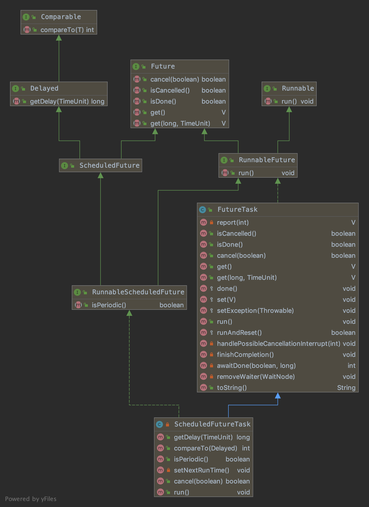
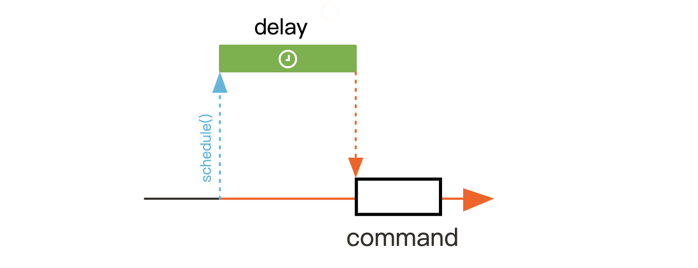
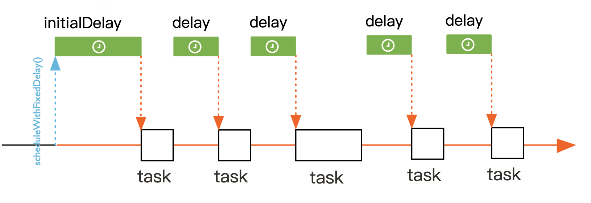

# Java任务调度

## 概述
Java并发包中`ScheduledExecutorService`接口定义了3种任务调度方式
1. 延迟执行
2. 固定频率执行
3. 固定延迟执行
```java
package java.util.concurrent;

public interface ScheduledExecutorService extends ExecutorService {
    // 延迟执行
    public ScheduledFuture<?> schedule(Runnable command, long delay, TimeUnit unit);
    
    // 延迟执行
    public <V> ScheduledFuture<V> schedule(Callable<V> callable, long delay, TimeUnit unit);

    // 周期性执行 固定频率
    public ScheduledFuture<?> scheduleAtFixedRate(Runnable command, long initialDelay,
                                                 long period, TimeUnit unit);
    // 周期性执行 固定延迟
    public ScheduledFuture<?> scheduleWithFixedDelay(Runnable command, long initialDelay,
                                                 long delay, TimeUnit unit);
}
```
`ScheduledThreadPoolExecutor`任务调度线程池是一个实现了`ScheduledExecutorService`接口的特殊线程池(ThreadPoolExecutor子类), 其工作队列采用的是延迟工作队列`DelayedWorkQueue`(**一个由数组实现的堆结构**), 非核心线程或者允许核心线程超时时, 线程的存活时间默认为10毫秒. 
```java
package java.util.concurrent;

public class ScheduledThreadPoolExecutor
        extends ThreadPoolExecutor
        implements ScheduledExecutorService {

    private static final long DEFAULT_KEEPALIVE_MILLIS = 10L;

    public ScheduledThreadPoolExecutor(int corePoolSize) {
        super(corePoolSize, Integer.MAX_VALUE,
                DEFAULT_KEEPALIVE_MILLIS, MILLISECONDS,
                new DelayedWorkQueue());
    }

    // ...
}
```
## 调度任务
由于任务调度池所执行的任务是一种特殊的任务, 任务调度线程池中使用`ScheduledFutureTask`来表示将要调度执行的任务.  
有如下属性
1. `time` 任务开始时间、触发时间 
2. `period` 任务执行周期, 0表示非周期性任务, 正数表示固定频率执行, 负数表示固定延迟执行
3. `heapIndex` 表示该任务在堆中(`DelayedWorkQueue`)的索引
```java
ScheduledFutureTask(Runnable r, V result, long triggerTime,
                    long sequenceNumber) {
    super(r, result);
    this.time = triggerTime;
    this.period = 0;
    this.sequenceNumber = sequenceNumber;
}

ScheduledFutureTask(Runnable r, V result, long triggerTime,
                    long period, long sequenceNumber) {
    super(r, result);
    this.time = triggerTime;
    this.period = period;
    this.sequenceNumber = sequenceNumber;
}
```
其类图如下


这里有三种调度任务类型
1. 延迟任务
    + 任务延迟一段时间后执行, triggerTime为当前时间+`delay`
    ```java
    new ScheduledFutureTask<V>(callable, triggerTime(delay, unit)));
    ```
    

2. 固定频率执行
    * 任务第一次触发时间为当前时间+`initialDelay`, 第二次触发时间为第一次触发时间+`period`
    * 当前任务执行完毕后, 会重置触发时间`time` = `time` + period, 然后将该任务重新放入到延迟任务队列中
    ```java
    new ScheduledFutureTask<Void>(command, null, triggerTime(initialDelay, unit), unit.toNanos(period));
    ```
    
    > 错误理解❌: 固定频率执行时, 如果某次任务执行时间较长达到了下次任务的触发时间, 下次任务会并行执行.  
    > 在当前任务结束后, 重置触发时间后才会将该任务再次放入到工作队列, 因此对于同一个调度任务来说, 任务是不会并发执行的.

3. 固定延迟执行
    * 任务第一次触发时间为当前时间+`initialDelay`, 第二次触发时间为第一次任务结束时间+`delay`
    * 当前任务执行完毕后, 会重置触发时间`time` = `now()` + delay, 然后将该任务重新放入到延迟任务队列中
    ```java
    new ScheduledFutureTask<Void>(command, null, triggerTime(initialDelay, unit), unit.toNanos(-delay));
    ```
    

## 延迟任务队列
通过`schedule()`、`scheduleAtFixRate()`、`scheduleWithFixedDelay()`等操作, 可以提交多种调度任务到线程池, 由于调度任务一般都具有一定的延迟, 后提交的任务可能先被执行(延迟小), 使用普通的FIFO工作队列则无法满足需求.  
`ScheduledThreadPoolExecutor`则采用了延迟工作队列`DelayWorkQueue`, 它是一个由数组实现的最小堆(任务的触发时间由小到大排序), 队列头部表示的则是触发时间最小的任务.  

### 上移shitUp()和下移shitDown()
`shitDown()`和`siftUp()`操作是堆结构的两个重要操作, 用于节点更新时(如`take()`, `poll()`, `offer()`), 维持堆的顺序
1. `shitUp`将元素`key`放入到数组`k`索引位置, 如果`key`比父节点小, 则向上移动, 直到符合最小堆 
```java
private void siftUp(int k, RunnableScheduledFuture<?> key) {
    while (k > 0) {
        int parent = (k - 1) >>> 1;
        RunnableScheduledFuture<?> e = queue[parent];
        if (key.compareTo(e) >= 0)
            break;
        queue[k] = e;
        setIndex(e, k);
        k = parent;
    }
    queue[k] = key;
    setIndex(key, k);
}
```

2. `shitDown`将元素`key`放入到数组`k`索引位置, 如果`key`比父节点大, 则向下移动, 直到符合最小堆, 向下移动时, 需要和其两个子节点中小的那个比较
```java
private void siftDown(int k, RunnableScheduledFuture<?> key) {
    int half = size >>> 1;
    while (k < half) {
        int child = (k << 1) + 1;
        RunnableScheduledFuture<?> c = queue[child];
        int right = child + 1;
        if (right < size && c.compareTo(queue[right]) > 0)
            c = queue[child = right];
        if (key.compareTo(c) <= 0)
            break;
        queue[k] = c;
        setIndex(c, k);
        k = child;
    }
    queue[k] = key;
    setIndex(key, k);
}
```
### remove(object)
删除操作实现:将数组最后一个元素放入到要删除元素的位置, 之后进行下移操作, 下移后如果元素位置没有移动, 则进行上移
```java
public boolean remove(Object x) {
    final ReentrantLock lock = this.lock;
    lock.lock();
    try {
        int i = indexOf(x);
        if (i < 0)
            return false;

        setIndex(queue[i], -1);
        int s = --size;
        RunnableScheduledFuture<?> replacement = queue[s];
        queue[s] = null;
        if (s != i) {
            siftDown(i, replacement);
            if (queue[i] == replacement)
                siftUp(i, replacement);
        }
        return true;
    } finally {
        lock.unlock();
    }
}
```
### offer(runnable)、put(runnable)、add(runnable)
添加操作: 数组元素个数`size`加1后, 将新元素放入到数组末尾, 之后进行上移操作
```java
public boolean offer(Runnable x) {
    if (x == null)
        throw new NullPointerException();
    RunnableScheduledFuture<?> e = (RunnableScheduledFuture<?>)x;
    final ReentrantLock lock = this.lock;
    lock.lock();
    try {
        int i = size;
        if (i >= queue.length)
            grow();
        size = i + 1;
        if (i == 0) {
            queue[0] = e;
            setIndex(e, 0);
        } else {
            siftUp(i, e);
        }
        if (queue[0] == e) {
            leader = null;
            available.signal();
        }
    } finally {
        lock.unlock();
    }
    return true;
}
```

### poll()
poll()方法, 是一个非阻塞的方法, 如果队列头元素还未到触发时间, 则返回null, 否则将头元素从队列中移除(将最后一个元素放入堆顶, 然后进行下移)
```java
public RunnableScheduledFuture<?> poll() {
    final ReentrantLock lock = this.lock;
    lock.lock();
    try {
        RunnableScheduledFuture<?> first = queue[0];
        if (first == null || first.getDelay(NANOSECONDS) > 0)
            return null;
        else
            return finishPoll(first);
    } finally {
        lock.unlock();
    }
}
```
### take()
take()方法是一个**可中断的阻塞方法**, 要么中断抛异常退出, 要么获取元素成功.  
这里采用了**Leader-Follower pattern(领导者-追随者模式)**, 在多个工作线程进行take()操作时, 如果首元素任务有延迟, 除了领导线程等待固定时间`awaitNanos`外(首元素任务延迟时间), 其它线程则无限等待`await()`直到收到一个`signal`信号.
```java
public RunnableScheduledFuture<?> take() throws InterruptedException {
    final ReentrantLock lock = this.lock;
    lock.lockInterruptibly();
    try {
        for (;;) {
            RunnableScheduledFuture<?> first = queue[0];
            if (first == null)
                available.await();
            else {
                long delay = first.getDelay(NANOSECONDS);
                if (delay <= 0)
                    return finishPoll(first);
                first = null; // don't retain ref while waiting
                if (leader != null)
                    available.await();
                else {
                    Thread thisThread = Thread.currentThread();
                    leader = thisThread;
                    try {
                        available.awaitNanos(delay);
                    } finally {
                        if (leader == thisThread)
                            leader = null;
                    }
                }
            }
        }
    } finally {
        if (leader == null && queue[0] != null)
            available.signal();
        lock.unlock();
    }
}
```
**为何除了领导者线程限时等待其它线程要无限等待?**  
队列中任务到达触发时间后, 才能从队列中获取出来. 因此必须要有至少一个线程等待时能够自动醒来(不需要`sigle`信号); 如果多个线程限时等待, 由于此时队列中只有一个到达触发时间的任务, 多个线程的话, 会增加线程间的竞争(`await()`或`awaitNaos(delay)`在醒来时, 线程又会重新获取锁(lock)), 这样应该会带来不必要的系统调用, 影响性能(个人猜测, 待我研究AQS...⏰). 而一个限时等待的线程即能满足需求, 又能减少线程间竞争提升性能, 何乐而不为呢?

**什么时候发送`signal`信号?**  
以下两种场景会发送`signal`信号
1. 有新任务到来, 并且当前新任务的触发时间, 要比队列中所有任务的触发时间短, 入队后发送`signal`信号  
**注意**, 这里会把`leader`领导者线程值置为`null`, 因为`signal`信号会唤醒一个(是随机还是有一定顺序? 待定⏰)等待线程, 不一定是领导者线程, 如果唤醒的是非领导线程, 会将其改为领导者线程(发生`take()`循环中)
```java
// offer()方法
if (queue[0] == e) {
    leader = null;
    available.signal();
}
```

2. 领导者线程线程获取任务成功后, 如果队列中有任务, 则发送`signal`信号, 唤醒一个限时等待的线程, 它将称为新的领导者限时等待.  
**注意**, 这里还有一个条件`leader==null`, 因为`await()`或者`awaitNanos(nanos)`是可中断的操作, `leader==null`保证只有领导者线程被中断时, 才会发送信号. 这个地方是真的细节
```java
// take()方法或poll(long timeout, TimeUnit unit)中
finally {
    if (leader == null && queue[0] != null)
        available.signal();
    lock.unlock();
}
``` 
### poll(timeout, unit)
`poll(timeout, unit)`方法发生允许核心线程超时或者是非核心线程, 限时从队列中获取任务, 其实现和take()比较相似, 不再分析.

## 工作机制
由于线程池提交的任务都是希望立即执行的(延迟为0), 而任务调度线程池提交的任务一般都不是立即执行, 甚至也有可能后提交的任务被先执行(延迟小). 因此两者的工作线程创建、任务缓存时机会有所不同
1. `ThreadPoolExecutor`在有新任务时, 如果工作线程大小小于核心线程, 则创建核心线程执行任务; 如果工作线程等于核心线程时并且队列没满, 则将任务缓存到队列中;
2. `ScheduledThreadPoolExecutor`在有新任务时, 会先将任务存储到**延迟工作队列**中, 之后如果工作线程大小小于核心线程大小, 则创建核心线程, 否则如果工作线程大小等于0(说明**核心线程大小为0**), 则创建非核心线程

### 调度任务创建
```java
public void execute(Runnable command) {
    schedule(command, 0, NANOSECONDS);
}

public ScheduledFuture<?> schedule(Runnable command,
                                    long delay,
                                    TimeUnit unit) {
    if (command == null || unit == null)
        throw new NullPointerException();
    RunnableScheduledFuture<Void> t = decorateTask(command,
        new ScheduledFutureTask<Void>(command, null,
                                        triggerTime(delay, unit),
                                        sequencer.getAndIncrement()));
    delayedExecute(t);
    return t;
}
```

## Spring任务调度实现