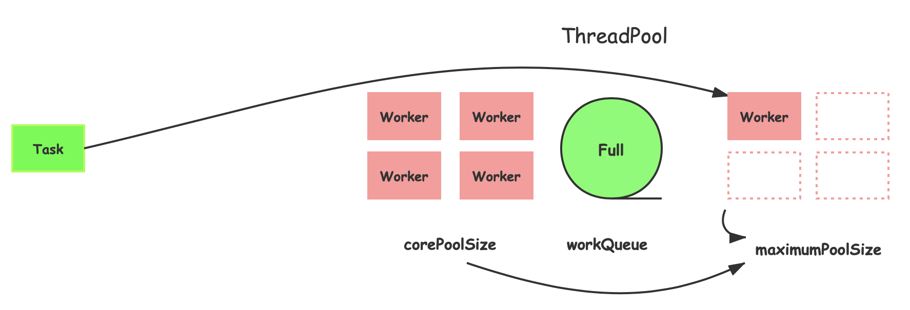

# 深入学习Java线程池及源码分析

## 核心参数
`ThreadPoolExecutor`线程池构造函数如下:
```java
public ThreadPoolExecutor(int corePoolSize,
                          int maximumPoolSize,
                          long keepAliveTime,
                          TimeUnit unit,
                          BlockingQueue<Runnable> workQueue,
                          ThreadFactory threadFactory,
                          RejectedExecutionHandler handler)
```
### corePoolSize
corePoolSize 线程池核心大小、基本大小. 当线程池中线程大小小于corePoolSize时, 线程池会每一个新来的任务都创建一个工作线程. 如下图所示:


### workQueue
workQueue 任务队列. 当线程池中线程大小达到corePoolSize时, 新来的任务被放入到工作队列中, 等待空闲下来的工作线程去执行. 如下图所示:


### maximunPoolSize
maimumPoolSize 线程池最大线程数量, 最大活动线程数量, 能同时活动的线程上限. 当工作队列满的时候, 才会创建超出corePoolSize但不会对于maximumPoolSize大小的线程. 如下图所示:


### keepAliveTime && unit
keepAliveTime && unit 线程空闲时间. 超出核心线程数量之外的线程, 如果发生空闲(工作队列为空, 没活干)并且空闲时间达到keepAliveTime时(是时候开除你了), 线程会退出.

### rejectedExecutionHandler
rejectedExecutionHandler 线程的拒绝策略、饱和策略, 即当工作队列填满并且活动线程数量为最大时, 饱和策略则开始生效.

如下为RejectedExecutionHandler接口
```java
package java.util.concurrent;
public interface RejectedExecutionHandler {
   void rejectedExecution(Runnable r, ThreadPoolExecutor executor);
}
```
线程池有四种饱和策略
1. AbortPolicy 中止策略, 线程池默认的饱和策略, 在任务被拒绝时, 抛`RejectedExecutionException`异常
```java
public void rejectedExecution(Runnable r, ThreadPoolExecutor e) {
    throw new RejectedExecutionException("Task " + r.toString() +
                                         " rejected from " +
                                         e.toString());
}
```
2. DiscardPolicy 抛弃策略, 悄悄的抛弃任务, 不抛异常
```java
// does nothing
public void rejectedExecution(Runnable r, ThreadPoolExecutor e) {
}
```
3. DiscardOldestPolicy 抛弃下一个将被执行的任务, 通俗来说, 也就是最早的任务, 然后尝试重新提交新的任务
```java
public void rejectedExecution(Runnable r, ThreadPoolExecutor e) {
    if (!e.isShutdown()) {
        e.getQueue().poll();
        e.execute(r);
    }
}
```
> 如果队列为优先级队列, 则会移除优先级最高的任务, 因此不要将优先级队列和抛弃最旧饱和策略一起使用
4. CallerRunsPolicy 调用者执行策略, 即线程池不会执行任务, 而是由调用线程(主线程)去执行
```java
public void rejectedExecution(Runnable r, ThreadPoolExecutor e) {
    if (!e.isShutdown()) {
        r.run();
    }
}
```
虽说名字听起来很高端, 但是从代码上看起来还是很容易理解的