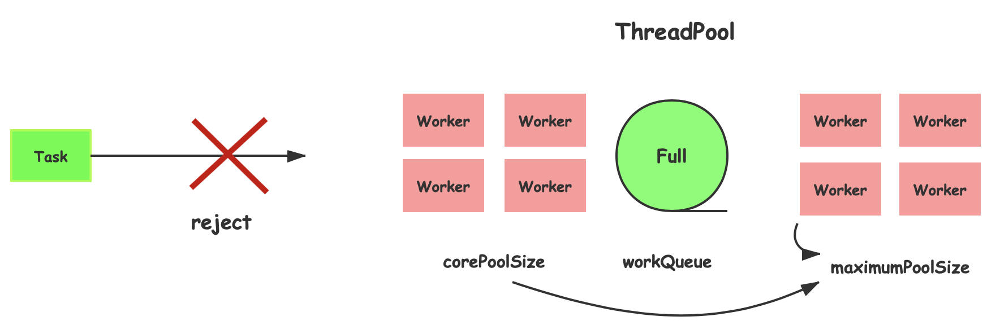

# 深入学习Java线程池及源码分析

## 核心参数
`ThreadPoolExecutor`线程池构造函数如下:
```java
public ThreadPoolExecutor(int corePoolSize,
                          int maximumPoolSize,
                          long keepAliveTime,
                          TimeUnit unit,
                          BlockingQueue<Runnable> workQueue,
                          ThreadFactory threadFactory,
                          RejectedExecutionHandler handler)
```
### corePoolSize
corePoolSize 线程池核心大小、基本大小. 当线程池中线程大小小于corePoolSize时, 线程池会每一个新来的任务都创建一个工作线程. 如下图所示:


### workQueue
workQueue 任务队列. 当线程池中线程大小达到corePoolSize时, 新来的任务被放入到工作队列中, 等待空闲下来的工作线程去执行. 如下图所示:

workQueue是一个阻塞队列, 在线程池中常用的实现有: `LinkedBlockingQueue`、`ArrayBlockingQueue`、`PriorityBlockingQueue`、`SynchronousQueue`.

### maximunPoolSize
maimumPoolSize 线程池最大线程数量, 最大活动线程数量, 能同时活动的线程上限. 当工作队列满的时候, 才会创建超出corePoolSize但不会对于maximumPoolSize大小的线程. 如下图所示:


### keepAliveTime && unit
keepAliveTime && unit 线程空闲时间. 超出核心线程数量之外的线程, 如果发生空闲(工作队列为空, 没活干)并且空闲时间达到keepAliveTime时(是时候开除你了), 线程会退出.

### rejectedExecutionHandler
rejectedExecutionHandler 线程的拒绝策略、饱和策略, 即当工作队列填满并且活动线程数量为最大时, 饱和策略则开始生效, 如下图所示：

如下为RejectedExecutionHandler接口
```java
package java.util.concurrent;
public interface RejectedExecutionHandler {
   void rejectedExecution(Runnable r, ThreadPoolExecutor executor);
}
```
线程池有四种饱和策略
1. AbortPolicy 中止策略, 线程池默认的饱和策略, 在任务被拒绝时, 抛`RejectedExecutionException`异常
```java
public void rejectedExecution(Runnable r, ThreadPoolExecutor e) {
    throw new RejectedExecutionException("Task " + r.toString() +
                                         " rejected from " +
                                         e.toString());
}
```
2. DiscardPolicy 抛弃策略, 悄悄的抛弃任务, 不抛异常
```java
// does nothing
public void rejectedExecution(Runnable r, ThreadPoolExecutor e) {
}
```
3. DiscardOldestPolicy 抛弃下一个将被执行的任务, 通俗来说, 也就是最早的任务, 然后尝试重新提交新的任务
```java
public void rejectedExecution(Runnable r, ThreadPoolExecutor e) {
    if (!e.isShutdown()) {
        e.getQueue().poll();
        e.execute(r);
    }
}
```
> 如果队列为优先级队列, 则会移除优先级最高的任务, 因此不要将优先级队列和抛弃最旧饱和策略一起使用
4. CallerRunsPolicy 调用者执行策略, 即线程池不会执行任务, 而是由调用线程(主线程)去执行
```java
public void rejectedExecution(Runnable r, ThreadPoolExecutor e) {
    if (!e.isShutdown()) {
        r.run();
    }
}
```
虽说名字听起来有点高大上, 但是从代码上看起来还是很容易理解的

## 线程池运行时参数的动态配置 TODO

## Executors介绍
熟悉线程池几个核心的参数后, 现在来看Executors创建线程池的几个静态方法, 会更容易理解.
### newFixedThreadPool 固定大小的线程池
```java
public static ExecutorService newFixedThreadPool(int nThreads) {
    return new ThreadPoolExecutor(nThreads, nThreads,
                                  0L, TimeUnit.MILLISECONDS,
                                  new LinkedBlockingQueue<Runnable>());
```
newFixedThreadPool 核心线程数量等于最大线程数量, 最大空闲时间为0, 线程不会空闲退出. `LinkedBlockingQueue`无参构造函数, 默认队列大小为`Integer.MAX_VALUE`, 因此newFixedThreadPool在任务的处理速度小于任务请求的速率, 那么队列中的任务可能会无限制的增加, 降低系统的吞吐量.
```java
public LinkedBlockingQueue() {
    this(Integer.MAX_VALUE);
}
```
### newCachedThreadPool 可缓存的线程池
```java
public static ExecutorService newCachedThreadPool() {
	return new ThreadPoolExecutor(0, Integer.MAX_VALUE,
    	                          60L, TimeUnit.SECONDS,
        	                      new SynchronousQueue<Runnable>());
```
newCachedThreadPool 核心线程数量为0, 最大线程数量为`Integer.MAX_VALUE`, 线程空闲时间为60s. 同样在任务到来速度如果大于任务处理速度时, 会带来如下问题:
1. 线程创建的开销本来就高, 延迟处理的请求
2. 大量线程频繁竞争CPU资源, 增加额外的性能开销
3. 线程也会大量占用系统资源如内存, 导致OOM

不过如果任务之间有依赖关系,使用newCacheThreadPool时, 不会发生死锁; 而使用有界线程池时, 则可能会导致线程饥饿死锁.
> `SynchronousQueue`用于避免任务排队, 能够将任务从生产者线程移交给工作着线程, 它不是一个真正的队列, 而是一种在线程之间进行移交的机制. <<Java并发编程实战>>

### newSingleThreadExecutor 单线程线程池
```java
public static ExecutorService newSingleThreadExecutor() {
    return new FinalizableDelegatedExecutorService
        (new ThreadPoolExecutor(1, 1,
                                0L, TimeUnit.MILLISECONDS,
                                new LinkedBlockingQueue<Runnable>()));
```

## 线程池生命周期
### 运行状态
线程池有以下5个状态
1. RUNNING 能够接收新任务和处理队列中的任务
2. SHUTDOWN 线程池不接收新任务, 但是会处理队列中的任务
3. STOP 不接受新任务, 也不会处理队列中的任务, 并且会中断处理中的任务
4. TIDYING 所有的任务都已结束, 并且工作线程数量为0, 到该状态后, 会执行行terminated()钩子方法
5. TERMINATED terminated()完成后

如下为线程池状态转化的有向无环图(DGA):


线程池使用了一个`AtomictInteger` ctl(control)来同时表示线程池运行状态以及worker线程数量. 其中Integer类型的高3位表示状态(5个状态, 至少需要3位来表示), 低29位表示工作线程数量(也就是工作线程数量最大为(2^29)-1, 目前肯定是够用的, 即使将来不够用了, 改为AtomicLong也很容易).
```java
private final AtomicInteger ctl = new AtomicInteger(ctlOf(RUNNING, 0));
private static final int COUNT_BITS = Integer.SIZE - 3; // 29
// 计数掩码
private static final int COUNT_MASK = (1 << COUNT_BITS) - 1; // 0b000111......1

// runState is stored in the high-order bits
// 0b111...111 << 29 = 0b111000...000
private static final int RUNNING    = -1 << COUNT_BITS;
//           0 << 29 = 0b000000...000
private static final int SHUTDOWN   =  0 << COUNT_BITS;
//           1 << 29 = 0b001000...000
private static final int STOP       =  1 << COUNT_BITS;
//           2 << 29 = 0b010000...000
private static final int TIDYING    =  2 << COUNT_BITS;
//           3 << 29 = 0b11000...000
private static final int TERMINATED =  3 << COUNT_BITS;

// Packing and unpacking ctl
private static int runStateOf(int c)     { return c & ~COUNT_MASK; }
private static int workerCountOf(int c)  { return c & COUNT_MASK; }
private static int ctlOf(int rs, int wc) { return rs | wc; }
```
`ctl`初始值为`0b111000...000`, 即为运行状态并且当前无工作线程.

**关于掩码**
> 掩码(mask) 在计算机学科及数字逻辑中指的是一串二进制数字，通过与目标数字的按位操作，达到屏蔽指定位而实现需求.
这里则使用了2个掩码
1. 计数掩码(高3位均为0, 低29位均为1)和ctl进行(`&`)与操作进行计数, 见`runStateOf(int c)`方法
2. 状态掩码(计数掩码求反, 高3位均为1, 低29位均为0)与ctl进行与操作获取线程池当前状态, 见`workerCountOf(int c)`方法

### 生命周期方法
```java
package java.util.concurrent;
public interface ExecutorService extends Executor {
    // 不接收新任务, 但是会处理队列中的任务 -> shutdown状态
    void shutdown();
    // 不接收新任务, 也不会处理队列中任务, 并且将队列中没处理的任务返回 -> stop状态
    List<Runnable> shutdownNow();
    // 是否为shutdown状态
    boolean isSutdown();
    // 是否为terminated状态
    boolean isTerminated();
    // 等待线程变为terminated状态
    boolean awaitTermination(long timeout, TimeUnit unit) throws InterruptedException;
}
```
#### shutdown() 方法
```java
public void shutdown() {
    final ReentrantLock mainLock = this.mainLock;
    mainLock.lock();
    try {
        checkShutdownAccess();
        advanceRunState(SHUTDOWN);
        interruptIdleWorkers();
        onShutdown(); // hook for ScheduledThreadPoolExecutor
    } finally {
        mainLock.unlock();
    }
    tryTerminate();
}
```
1. 将线程池运行状态修改为`shutdown`
2. 中断**空闲**线程, 空闲线程指的是工作队列workQueue为Empty
3. 执行onShutdown()钩子方法
4. 尝试终止, 对线程池状态进行判断, 如果满足terminate条件(无工作线程、队列为空、执行完terminated钩子方法), 则状态修改为terminated

#### shutdownNow() 方法
```java
public List<Runnable> shutdownNow() {
    List<Runnable> tasks;
    final ReentrantLock mainLock = this.mainLock;
    mainLock.lock();
    try {
        checkShutdownAccess();
        advanceRunState(STOP);
        interruptWorkers();
        tasks = drainQueue();
    } finally {
        mainLock.unlock();
    }
    tryTerminate();
    return tasks;
}
```
1. 将线程池运行状态修改为`stop`
2. 中断所有**工作**线程(正在执行任务的线程、当前没任务可做的空闲线程)
3. 执行drainQueue方法, 将任务队列中的任务全部移出, 并返回
4. 尝试终止, 此时工作队列已经为空了, 需要判断是否还有运行中的任务

## 任务提交与work线程的创建(划重点) TODO
