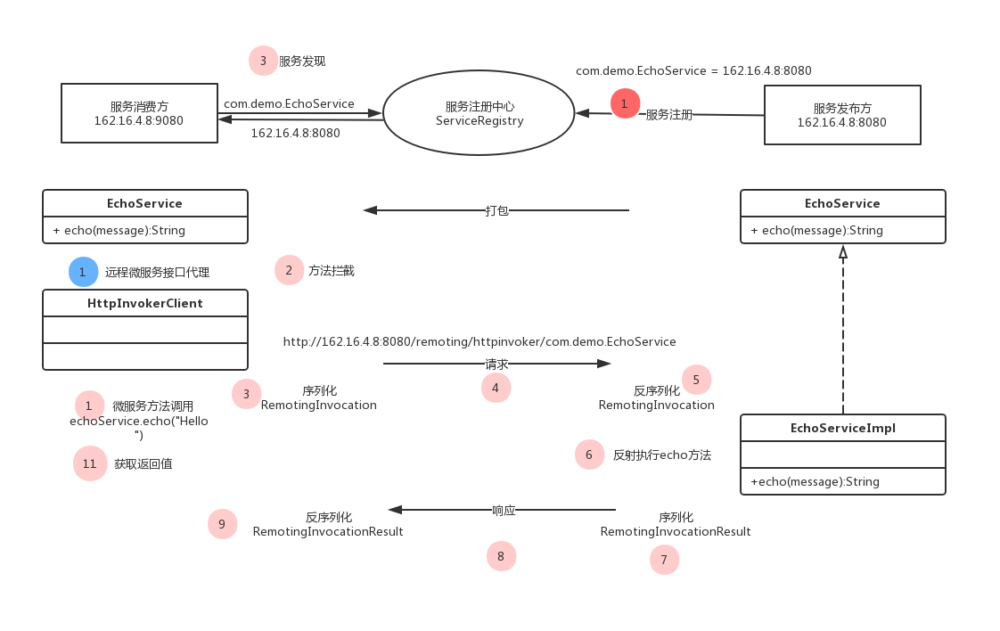

# 微服务-服务消费方实现

[TOC]

## 示例

```java
// 服务发布方
@Remoting
public interface EchoService {
    String echo(String message);
}

@Component
public class EchoServiceImpl {
    
    @Override
    public String echo(String message) {
        return message;
    }
}
```

```java
// 服务消费方
@Component
public class FooService {
    @Autowired
    private EchoService echoService;
    
    public void foo() {
        echoService.echo("Hello, world!");
    }
}
```
想必有使用过铁犀牛微服务的人对以上的程序都会比较熟悉。服务发布方，编写微服务接口(带有`@Remoting`注解的接口)及其实现，然后将微服务接口打包发送给服务消费方，服务消费方就能够调用本地接口一样调用微服务接口。

## 微服务消费方实现
微服务接口的实现是在服务发布方，而服务消费方没有接口实现，那么为什么`EchoService`在消费方能够注入(`@Autowired`)成功呢?

铁犀牛则是使用了Spring中的`BeanFactoryPostProcessor`和`FactoryBean`

### Bean工厂后置处理器
`BeanFactoryPostProcessor`是Spring提供的一种容器扩展机制，能够在实例化Bean对象之前，对注入到容器的Bean进行修改，当然也可以对Bean进行注册。
```java
package org.springframework.beans.factory.config;

import org.springframework.beans.BeansException;
@FunctionalInterface
public interface BeanFactoryPostProcessor { 
    // 在bean实例化之前，对beanFactory中的bean进行修改
    void postProcessBeanFactory(ConfigurableListableBeanFactory beanFactory) throws BeansException;
}
```
铁犀牛中通过开发`AnnotationBeanDefinitionRegistryPostProcessor`实现了在容器启动时，通过扫描某类注解(如`@Remoting`、`@JdbcRepository`、`@RestApi`)，来为`每一个`有该注解标注的类或接口都生成一个对应的FactoryBean, 并将该FactoryBean注册到容器中。 如示例中，`FooService`中的注入的`EchoService`就是某个FactoryBean所代理的对象。
```java
package org.ironrhino.core.spring.configuration;

public abstract class AnnotationBeanDefinitionRegistryPostProcessor<A extends Annotation, FB extends FactoryBean<?>>
		implements BeanDefinitionRegistryPostProcessor, EnvironmentAware {
    
    private final Class<A> annotationClass; // 注解类型

	private final Class<FB> factoryBeanClass; // FactoryBean类型

	@Getter
	@Setter
	private String[] packagesToScan; // 扫描的包路径
    
	// 略
}
```
> 注: FactoryBean与BeanFactory的区别, FactoryBean是一个Bean, 而BeanFactory是一个管理Bean的工厂

那么接下来就需要指定是用哪个FactoryBean来代理微服务接口了，如下可以看出`Remoting`接口是由`HttpInvokerClient`代理的
```java
package org.ironrhino.core.remoting.client;

@Component
public class RemotingServiceRegistryPostProcessor
		extends AnnotationBeanDefinitionRegistryPostProcessor<Remoting, HttpInvokerClient> {

	@Override
	public void processBeanDefinition(Remoting annotation, Class<?> annotatedClass, RootBeanDefinition beanDefinition)
			throws BeansException {
		MutablePropertyValues propertyValues = new MutablePropertyValues();
		propertyValues.addPropertyValue("serviceInterface", annotatedClass.getName());
		beanDefinition.setPropertyValues(propertyValues);
	}
}
```
以上几个类的类图如下：


### HttpInvokerClient 微服务远程调用
如果对FactoryBean不是很了解的话，可以看如下示例：
```java
public interface BarService {
    String hello(String message);
} 

@Component
public class BarServiceImpl implements FactoryBean<BarService> {

	private final BarService service;

	public BarServiceImpl() {
		service = s -> s;

	}

	@Override
	public BarService getObject() throws Exception {
		return service;
	}

	@Override
	public Class<?> getObjectType() {
		return BarService.class;
	}

}


public class Main {
    @Autowired
    private BarService barService; 
    @Autowired
    private BarServiceImpl barServiceImpl;
    
    // 注：这里barService和barServiceImpl是不一样的，barService == barServiceImpl.getObject()
}
```
理解上面程序后，会更容易理解`HttpInvokerClient`. `BarServiceImpl`仅仅是代理了`BarService`，而`HttpInvokerClient`更为通用，用于代理任何有`@Remoting`标注的接口
其类图如下：


可看出`MethodInterceptorFactoryBean`实现了`MethodInterceptor`方法拦截器，示例中消费方调用`echoService`的`echo`方法执行时便会被拦截到。
其中`invoke`方法做了做了如下事情：

1. 校验所拦截方法的参数，参数不合法时，可减少请求来回
2. 接口默认方法的话，不需要向服务端发送请求
3. 特殊方法返回类型的特殊处理，如`Callable`、`Future`、`ListenbleFuture`, 通过开启一个线程向服务端发送请求(调用doInvoke方法)，实现异步支持
4. 调用doInvoke方法
5. 返回结果校验

doInvoke是一个抽象方法，用于远程服务调用
```java
package org.ironrhino.core.spring;

public abstract class MethodInterceptorFactoryBean implements MethodInterceptor, FactoryBean<Object> {
    @Setter
    private volatile ExecutorService executorService; // 线程池 用来支持异步处理
    
    @Autowired(required = false)
    private Validator validator; // 校验器
    
    // ...
    	
    @Override
    public Object invoke(MethodInvocation methodInvocation) throws Throwable {
        // ...
        doInvoke(methodInvocation);
        // ...
    }
    
    protected abstract Object doInvoke(MethodInvocation methodInvocation) throws Throwable;
}
```

接下来是`FallbackSupportMethodInterceptorFactoryBean`, 用于在远程调用失败后，调用本地的实现，逼格高点的说法叫服务降级
```java
package org.ironrhino.core.spring;
public abstract class FallbackSupportMethodInterceptorFactoryBean extends MethodInterceptorFactoryBean {
    
	private Object fallback; // 微服务远程接口的本地实现(以@FallFack标注)

	@Override
	public Object invoke(MethodInvocation methodInvocation) throws Throwable {
		try {
			return super.invoke(methodInvocation);
		} catch (Throwable ex) {
			if (shouldFallBackFor(ex)) {
			    // ...
			        
			    // ...
				return methodInvocation.getMethod().invoke(fallback, methodInvocation.getArguments());
			}
			throw ex;
		}
	}

	protected abstract boolean shouldFallBackFor(Throwable ex);

}
```
最后就是远程微服务接口的客户端的真正实现了 `HttpInvokerClient`
```java
package org.ironrhino.core.remoting.client;

public class HttpInvokerClient extends FallbackSupportMethodInterceptorFactoryBean {

	@Getter
    @Setter
    private Class<?> serviceInterface; // 远程微服务接口
	
	@Value("${httpInvoker.serializationType:}")
    private String serializationType; // 序列化类型，默认为Java
    
    @Setter
    @Autowired(required = false)
    private ServiceRegistry serviceRegistry; // 服务注册中心，这里用来服务发现
    
    protected Object doInvoke(MethodInvocation methodInvocation) throws Throwable {
        // ...
    }
}
```
在服务消费方，服务注册中心用于发现服务，根据远程微服务接口的全限类型名，如`com.demo.service.EchoService`，来获取服务发布方的服务IP及端口
拼装`serviceUrl`,如`http://162.16.4.8:8080/remoting/httpinvoker/com.demo.EchoService`

接下来要做的就是向该地址发送Http请求，告诉它我要执行你的`echo`方法，并且参数值是`Hello, world!`, 服务端接收信息后通过反射执行该方法，并将返回信息`Hello, world!`发送给消费方。
而实际上方法名、方法参数都封装到了一个`RemoteInvocation`对象中，而服务端的返回信息以及异常信息封装在`ResultRemoteInvocation`对象中。


## 微服务执行流程

